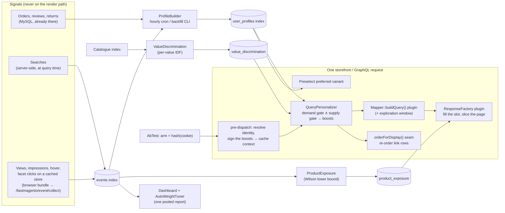

<p align="center">
  
  
  
  
  
  
  <a href="https://packagist.org/packages/parkktech/fastmagento-personalization"></a>
</p>

# FastMagento Personalisation

**Per-shopper ranking for the pages FastMagento already serves from OpenSearch — built from what
each shopper buys, searches for, filters by, reviews and returns; applied as boosts, never as
filters; proven by a built-in A/B test; and fair to the products nobody has seen yet.**

It is the **optional companion** to [FastMagento](https://github.com/parkktech/FastMagento). Core
installs and serves without it. With this module installed and switched **off**, every page is
**byte-identical** to core — that is the acceptance test every release passes, and it holds by
construction rather than by comparison (see [Constraints](#constraints-the-rules-that-never-bend)).
It ships **dark and off**: nothing on the storefront changes until you turn it on.

> **Status:** beta (0.x). Requires FastMagento core **2.7 or later** — the first core release that
> carries the extension seams this package plugs into. Releases are cut automatically from `main`
> (tag + GitHub Release + Packagist).

---

## Table of contents

- [Quick install](#-quick-install)
- [Two switches and a dial](#-two-switches-and-a-dial)
- [How the weighing works, in plain terms](#%EF%B8%8F-how-the-weighing-works-in-plain-terms)
- [Which attributes it learns — any store, not just apparel](#-which-attributes-it-learns--any-store-not-just-apparel)
- [See it work: three shoppers, one colour each](#-see-it-work-three-shoppers-one-colour-each)
- [Troubleshooting — `fastmagento:doctor`](#-troubleshooting--binmagento-fastmagentodoctor)
- [Why it exists](#why-it-exists)
- [Problems it solves (problem → solution)](#problems-it-solves-problem--solution)
- [Features at a glance](#features-at-a-glance)
- [Feature: shopper profiles from signals you already have](#feature-shopper-profiles-from-signals-you-already-have)
- [Feature: two gates before a boost is emitted](#feature-two-gates-before-a-boost-is-emitted)
- [Feature: personalised search, listings and recommendations](#feature-personalised-search-listings-and-recommendations)
- [Feature: stated requirements ("facts")](#feature-stated-requirements-facts)
- [Feature: the exploration slot](#feature-the-exploration-slot)
- [Feature: variant preselection](#feature-variant-preselection)
- [Feature: the A/B test that proves it](#feature-the-ab-test-that-proves-it)
- [Feature: auto-tuned weight](#feature-auto-tuned-weight)
- [Feature: signal capture that survives a full-page cache](#feature-signal-capture-that-survives-a-full-page-cache)
- [Feature: cache correctness](#feature-cache-correctness)
- [Feature: GraphQL and headless](#feature-graphql-and-headless)
- [Feature: the dashboard](#feature-the-dashboard)
- [Theme compatibility](#theme-compatibility)
- [Edition compatibility](#edition-compatibility)
- [What it touches on each surface](#what-it-touches-on-each-surface)
- [Architecture](#architecture)
- [Data, privacy and data-subject requests](#data-privacy-and-data-subject-requests)
- [Configuration reference](#configuration-reference)
- [Operator CLI reference](#operator-cli-reference)
- [Cron](#cron)
- [Acceptance evidence](#acceptance-evidence)
- [Constraints — the rules that never bend](#constraints-the-rules-that-never-bend)
- [Installation, upgrade and uninstall](#installation-upgrade-and-uninstall)
- [FAQ](#faq)
- [License](#license)

---

## 🚀 Quick install

```bash
composer require parkktech/fastmagento-personalization
bin/magento module:enable ParkkTech_FastMagentoPersonalization
bin/magento setup:upgrade
bin/magento setup:di:compile                 # production mode only
bin/magento setup:static-content:deploy -f   # ships its own storefront bundle
bin/magento cache:flush

# Warm the data BEFORE you switch serving on (both also run hourly from cron):
bin/magento fastmagento:profile:backfill                   # profiles from order history (resumable)
bin/magento fastmagento:personalization:discrimination     # per-value catalogue discrimination

# Then confirm every wiring point, index and cron is in place:
bin/magento fastmagento:doctor
```

**Requirements:** `parkktech/fastmagento` ≥ 2.7 on the same store and the same OpenSearch cluster,
Magento 2.4.x with OpenSearch as the search engine, PHP 8.1–8.5. A full-page cache (built-in or
Varnish) in front of the storefront is supported and expected. The module declares `<sequence>`
after `ParkkTech_FastMagento` and depends on it in `composer.json`; it cannot be installed without
core.

> 🎨 **Themes.** Verified on **Hyvä**, **Luma** and **Swissup Breeze**. The storefront bundle is
> self-contained (no jQuery, RequireJS or Alpine, and no dependency on core's `fastmagento.js`), so
> it works the same on all three and degrades on its own if only one package is deployed.

---

## 🎛 Two switches and a dial

Everything lives under **Stores › Configuration › FastMagento › Personalisation (beta)**. Three
settings decide what happens; the rest are tuning.

| Setting | Path | Default | What it does |
|---|---|---|---|
| **Build Shopper Profiles** | `fastmagento/personalization/build_profiles` | **On** | Aggregate purchase, review, return, search and facet history into per-shopper profiles. Runs off the request path (hourly cron + CLI). Safe to leave on: nothing is *served* from a profile until the next switch. Turning it off means a cold start whenever you enable serving. |
| **Apply To Storefront** | `fastmagento/personalization/enabled` | **Off** | Use the profiles to re-order category listings, search results, and related / up-sell / cross-sell rows. Off ⇒ byte-identical to core. |
| **Exploration Slot (% of page one)** | `fastmagento/personalization/exploration_percent` | **10** | Share of page one reserved for products that have not been shown enough to judge. `0` disables it. Never touches curated link rows. |

Two more are independent of the three above and worth knowing about on day one:

- **Record Searches And Facet Selections** (`collect_events`, on) — the two strongest stated
  signals a storefront sees and normally throws away. You can record without profiling, and
  profile without serving.
- **A/B Test** (`ab_enabled`, off) — split shoppers 50/50 and let the dashboard compare what each
  half buys. The only way to know personalisation is *selling more* rather than merely ranking
  differently. Required for *Auto* weight.

---

## 🧭 Which attributes it learns — any store, not just apparel

Nothing in the ranking knows what a colour is. What it knows is: *this shopper keeps choosing the
same value of some attribute, and that value is rare enough on this page that putting it first
changes something.* Colour and size are simply the attributes an apparel store's shoppers are most
consistent about. A fastener store's shoppers are consistent about thread size and material; a
chess store's about material and piece style; a tyre store's about a size. The mechanism is
identical. Only the attribute list differs — and that list now comes from **your** catalogue, not
from a constant in the code.

### Which attributes are counted

| Step | Rule | Where you see it |
|---|---|---|
| 1 | **Attributes To Profile** (admin, comma-separated codes) when it is set | the setting itself |
| 2 | Otherwise **auto-detect**: every `select` / `multiselect` product attribute that is filterable on category pages or in search, has at least two options and is not a system attribute. `color` and `size` lead when they exist, then the widest attributes first, capped at 20. | `fastmagento:doctor` → *Profiled attributes* |
| 3 | Every attribute you mapped under **Stated Requirements** is always added | same line, after `facts:` |

Two details that matter outside apparel:

- **Multiselects count every value.** A top listed as *Organic Cotton, Spandex* is half an
  observation of each. Material, pattern, features, compatible-with lists all work this way.
- **Variants inherit their parent's attributes.** The thing a shopper actually buys is the child
  (size M, blue); the material, the style, the piece set, the thread pitch usually live on the
  configurable parent. The child's own values win; the parent's fill in the rest. Without this a
  shopper who buys wool coat after wool coat would never be seen to prefer wool.

The attribute list is a *what to count* decision only. **Profiling an attribute never forces a
lift.** Whether a value can move anything is decided at ranking time, per value, per page — which
is the part that makes a wide list safe.

### The formula, and why a store that only sells plastic pieces is handled

For every value a shopper leans towards, on every request, the boost is:

```
uplift = share_in_history × strength × confidence × min(1, idf ÷ 2) × surface_impact × category_bonus

idf    = ln( products_in_population ÷ products_in_population_carrying_the_value )
refuse = the value is on more than half of the population, or on none of it
```

and the **population** is:

| Page | Population the value is measured against |
|---|---|
| a category listing, when that category has **20 or more** products | **that category** (measured per category, per store view) |
| a smaller category | the whole store |
| search, recommendations | the whole store |

So the same preference is judged differently on different pages, which is exactly what you want.
From the demo store, one shopper who buys Organic Cotton tops:

| Value | Population | Share | Result |
|---|---|---|---|
| Organic Cotton | store | 22 % (idf 1.52) | lifted in search and recommendations |
| Organic Cotton | *Women › Tops* (50 products) | 18 % | lifted on that listing, gated on the category |
| Organic Cotton | *Women › Bottoms* (25 products) | **52 %** | **refused there** — half the page already is; the boost falls to her next material |
| Solid (pattern) | store | 67 % | refused everywhere, although she buys it 100 % of the time |
| M (size) | store | 52 % | refused |

That last column is the answer to "what if the site only sells plastic chess pieces": *Plastic*
is on 100 % of the population, it is refused on every page, and
`fastmagento:personalization:discrimination --show=material` says so in the verdict column.
Nothing is lifted on material; whatever else the shopper is consistent about (piece style,
king height, weight class) is judged on its own share. A store that sells plastic, wood and
metal sets gets a material lift for the shopper who always buys wood — and the shopper who buys
all three gets none, because *strength* (how concentrated the choices are) never reaches the gate.

### Setting up a non-apparel store

1. Make the attributes shoppers choose by **filterable** (Stores › Attributes › Product ›
   Storefront Properties) — or list them under *Attributes To Profile*. Values must be select /
   multiselect **options**: a decimal or text attribute (`length = 0.25`) is not profiled, so model
   sizes shoppers pick between as options (`1/4"`, `5/16"`). Spelling variants of one value
   (`32x10R15`, `32x10-15`) are folded before counting.
2. `bin/magento fastmagento:personalization:discrimination` (measures the store and every
   category with 20+ products), then `bin/magento fastmagento:profile:backfill`.
3. `bin/magento fastmagento:doctor` — read *Profiled attributes* and *Discrimination table*.
4. For one real customer: `bin/magento fastmagento:profile:inspect --customer=<id>` shows what
   was counted and which gate each attribute passed or failed;
   `fastmagento:personalization:explain --customer=<id> --category=<id>` shows the clauses,
   each tagged with the share of the *store* or the *category* that carries the value.
5. Turn on the A/B test and let the dashboard decide whether it sells more on **your** data.

---

## ⚖️ How the weighing works, in plain terms

Personalisation here is a chain of small, visible decisions. Nothing in it is a black box, and
every step has a control you can turn. Read top to bottom: this is exactly the order the code
runs in.

### 1. Signals — what the store learns from

| Signal | Counts as | Default weight | Why that weight |
|---|---|---|---|
| A **purchase** | one observation per unit bought, of the *variant* bought (size, colour…) | **100** | what the shopper settled for, after stock, price and delivery had their say |
| A **search** or a **facet click** | one observation of what they asked for | **150** (*Weight Of Searches And Facets vs Purchases*) | stated before anything interfered — stronger evidence than a purchase |
| Something **saved for later** | one observation | same as a stated signal | a per-product statement, uncontaminated |
| A **product view** | one observation | **25** | weak evidence, weighted as such |
| A **one-star review** or a **return** | a *negative* on that product | product-level only | never becomes "dislikes blue" — a return is usually the wrong size |
| **Time** | older evidence fades | **half-life 180 days** (*Recency Half-Life*) | a purchase from six months ago counts half; 0 turns fading off |

The observations are counted per attribute — the ones your catalogue makes filterable, or the
ones you list (see [Which attributes it learns](#-which-attributes-it-learns--any-store-not-just-apparel)) —
after spelling variants of the same value are folded into one, and both **globally** and **per category
bought from** (ancestors included — a hoodie bought in *Women › Tops › Hoodies* is evidence on
*Tops* too).

### 2. Gates — when a preference is real enough to act on

Two questions, both must be yes:

- **Does this shopper really have the preference?** Two numbers per attribute:
  *strength* (how concentrated the choices are — a shopper who buys every colour has no colour
  preference) must reach *Minimum Affinity Concentration* (**35**), and *confidence* (how much
  history there is — one purchase is not a taste) must reach *Minimum Confidence* (**50**).
- **Would acting on it change anything?** Measured on your catalogue, per value: a value most
  products carry cannot re-order a page (boosting "size L" when half the catalogue has L moves
  nothing and reports success). Values near-uniform across the catalogue are refused; rare
  values score higher. On a category listing the measurement is **that category's** (when it has
  20+ products): a material that is rare in the store but on every product in one category is
  refused on that category's page and lifted everywhere else. There is no list of "good" or
  "bad" attributes — only measurement, kept fresh by the hourly cron.

A **stated requirement** — a size or a year the shopper typed into the search box and you mapped
with *Stated Requirements — Attribute Mapping* — skips the first gate (there is nothing to infer)
and ranks at *Strength Of A Stated Requirement* (**300 %**) of the strongest inferred preference:
what someone typed beats what we worked out about them.

### 3. Boosts — how much a preference pushes

For each value that passed both gates, the boost is:

```
share of their choices × strength × confidence × catalogue discrimination × surface impact
```

capped at the **2** strongest values per surface (*Maximum Boosted Values Per Surface* — a
page-cache setting first: every distinct boost combination is one more cached variant of every
page). The **surface impact** dials are the main volume controls:

| Surface | Dial | Default | Meaning |
|---|---|---|---|
| Search results and instant search | *Impact — Search Results* | **25** | applied after text relevance, so a specific search still wins |
| Category listings | *Impact — Category Listings* | **25** | the boost size; how far it can move a product is decided in step 4 |
| Related, up-sell, cross-sell | *Impact — Related, Up-sell & Cross-sell* | **50** | a recommendation row exists to be relevant; the merchant's set is the only pool |

Then one dial over all of them — *Personalisation Weight*: **Normal**, **Less** (half), **More**
(nearly double), or **Auto** (a slow nightly tuner that moves toward whatever the A/B test shows
converts best, and says on the dashboard why it is holding still).

**Boosts only ever push up. Nothing is ever hidden.** A shopper who buys black sees black tops
first, and every other top exactly where it would have been otherwise.

### 4. Where the boosts land — surface by surface

- **Search**: the boost multiplies the relevance score. Two products with a similar text match
  will re-order; a product that matches the words much better still wins.
- **Category listings** (*Category Listing Order For Profiled Shoppers*, default
  *position-aware personalised*): your merchandising order becomes a **prior** rather than the
  law. Think of every product carrying its merchant rank as a handicap that grows with distance
  from the top; the shopper's boost, multiplied by *Strength* (**6**), is what can overcome it,
  and *Band* (**12** positions) says how far. In practice: a product this shopper is owed climbs
  up to about a page; products they have no preference about keep their order relative to each
  other; page three stays page three. If the profile knows what they buy **in this category**,
  that set is used instead of the global one, weighted by *Category-Specific Preference Bonus*
  (**150 %**). Choose *merchant position* to get the old behaviour: the listing never changes
  except among products sharing a position.
- **Recommendation rows**: only the order changes; the products the merchant linked are the
  products shown.
- **Configurable product pages**: the variant the shopper usually buys is preselected when in
  stock (*Preselect The Variant A Shopper Prefers*); everything stays selectable.

### 5. Balances — what keeps it honest

- **Exploration slot** (*Exploration Slot*, **10 %** of page one): the last card or so on page
  one goes to the least-shown product that still matched, so new stock enters the loop. Runs for
  every shopper, personalised or not.
- **A/B test** (*A/B Test*): half of shoppers get personalisation, half get the store exactly as
  it is; the dashboard compares what each half buys. This is the only way to know it sells more.
- **Everything is a boost, never a filter**, on every surface, in every mode.

### A worked example (from the demo store)

A shopper with eleven orders: 13 of 14 colour choices were **black**, sizes were XS twice.

- Colour: strength 0.86, confidence 1.0 → passes gate 1. Black is on 34 % of listings → passes
  gate 2 (discriminating enough). **Actionable.**
- Size: strength 1.0 but confidence 0.49 → fails gate 1 (two data points). Even if it passed, XS
  is near-uniform across the apparel catalogue → would fail gate 2. **Ignored** — correctly.
- Search "hoodie": boost `+0.11` on black → the five hoodies with a black variant move ahead of
  the four without; text relevance still decides among them.
- *Tops* listing, personalised order: the four tops with a black variant lead the page, the other
  eight keep their merchant order; the guest sees the merchant order unchanged.
- The same shopper in the A/B **control** arm sees the merchant order everywhere — the profile is
  built, nothing reads it.

`bin/magento fastmagento:personalization:explain --customer=<id> --surface=plp --category=<id>`
prints these exact numbers for any shopper, and which gate stopped each value that was not used.

### Which control to turn

| You want… | Turn |
|---|---|
| more or less personalisation everywhere | *Personalisation Weight* (or *Auto* with the A/B test on) |
| listings to move more / less | *Strength*, then *Band* |
| listings never to move | *Category Listing Order* → merchant position |
| search to stay strictly relevance-first | lower *Impact — Search Results* |
| recommendations in the merchant's order | *Impact — Related, Up-sell & Cross-sell* = 0 |
| fewer "guessed" preferences | raise *Minimum Confidence* / *Minimum Affinity Concentration* |
| purchases to count more than searches | lower *Weight Of Searches And Facets vs Purchases* |
| old behaviour to matter less | shorten *Recency Half-Life* |
| new products to get more exposure | raise *Exploration Slot* |
| to know whether any of it sells more | *A/B Test* on, read the dashboard |

---

## 👀 See it work: three shoppers, one colour each

The quickest way to believe any of this is to build shoppers whose history is unambiguous and
watch every surface follow them. This is exactly what was run on the demo store (Magento 2.4.9,
sample data, Hyvä), and what you can reproduce on yours.

**Setup.** Three customers, each with eight to ten orders of configurable products, always the
same colour and the same size: *Blue + M*, *Red + XL*, *Gray + S*. Then:

```bash
bin/magento fastmagento:profile:backfill --restart
bin/magento fastmagento:profile:inspect --customer=<id>
bin/magento fastmagento:personalization:explain --customer=<id> --surface=plp --category=<id>
```

**What the profiles said.** Colour: strength 1.0, confidence 1.0, actionable — Blue on 43 % of
listings, Red on 29 %, Gray on 17 %. Size: strength 1.0, confidence 1.0, but **non-discriminating**
("M" is on 52 % of the catalogue), so it is refused for ranking and kept for the product page. Each
shopper also got category-scoped sets for the men's categories they bought in.

**What each shopper then saw, against a guest** (A/B test off for the comparison):

| Surface | Guest | Blue + M shopper | Red + XL shopper | Gray + S shopper |
|---|---|---|---|---|
| *Men › Hoodies* listing (category-scoped set, ×1.5) | merchant order | all six blue-capable hoodies first, rest in merchant order | the six red ones first | both gray ones first |
| *Women › Tops* listing (no scoped set → global colour) | merchant order | blue tops rise within the band | the one red-capable top first | the gray tops first |
| Instant search "hoodie" | relevance order | blue hoodies ahead among equal matches | red ahead | gray ahead |
| Product page of a hoodie sold in Black / Gray / Orange | no preselection | size **M** preselected | size **XL** preselected | size **S** and colour **Gray** preselected |
| That product's related row (12 hoodies) | merchant order | the six blue ones lead, all twelve present | the red ones lead | the gray one leads |

Three things worth noticing in that table, because they are the design rather than accidents:

- **Size steers the variant, not the listing.** M is on half the catalogue; boosting it would
  shift every product equally and change nothing. Among one product's variants it is exactly
  right, so that is where it is used.
- **Colour is only preselected where the product has it.** The blue and red shoppers got their
  size but not their colour on a product sold in black, gray and orange; the gray shopper got both.
- **Nothing disappeared.** Every listing kept every product, every related row kept all twelve;
  only the order changed, and only for shoppers with an actionable preference. The guest saw the
  store exactly as merchandised.

With the A/B test **on**, two of the three shoppers happened to hash into the control arm and saw
the merchant order everywhere while their profiles kept building — which is what the control arm
is for. The dashboard counts what each arm buys; `explain` tells you which arm a shopper is in.

---

### A fourth shopper, no colour at all

`organic.cotton@example.com` bought eight *Women › Tops* in six different colours and four sizes.
The only thing the orders have in common is a material.

```
$ bin/magento fastmagento:profile:inspect --customer=6
  pattern   strength=1.00  confidence=1.00  n=8   ACTIONABLE but NON-DISCRIMINATING — "Solid" is on 67% of the catalogue
  material  strength=0.49  confidence=1.00  n=8   ACTIONABLE ("Organic Cotton" on 22% of listings, idf 1.52)
       Organic Cotton  56.2%  ██████████████
  color     strength=0.25  confidence=1.00  n=8   ignored (too spread out, or too little evidence)

$ bin/magento fastmagento:personalization:explain --customer=6 --category=21     # Women › Tops
PLP  +0.0885  material = 157   inferred Organic Cotton   [18% of the category carries it]

$ bin/magento fastmagento:personalization:explain --customer=6 --category=22     # Women › Bottoms
PLP  +0.0077  material = 148   inferred Lycra®           [8% of the category carries it]
     +0.0070  material = 142   inferred Cocona®          [16% of the category carries it]
```

On *Women › Tops* she is lifted on Organic Cotton (18 % of that category). On *Women › Bottoms*
Organic Cotton is 52 % of the category, so it is refused there and her next two materials rank
instead. Through Varnish, logged in, the first Organic Cotton top moves from fourth to first;
the guest page is unchanged. Colour, which she has no consistent taste in, is never touched.

## 🩺 Troubleshooting — `bin/magento fastmagento:doctor`

Every failure mode of a ranking feature is silent: the storefront keeps returning HTTP 200 while
the boosts quietly stop being emitted, the cache quietly serves one shopper's order to another, or
the A/B test quietly counts one arm. So this module registers a **Personalisation** section with
core's doctor (through core's check-provider pool — the core doctor carries no personalisation
checks of its own; the section exists only while this module is installed) and every line names
the command that fixes it.

| Check | Catches |
|---|---|
| **Build switch** | applying without building — the one combination that is actively broken (profiles go stale, new shoppers never get one) |
| **Profile index / mapping / coverage / freshness** | index missing (normal for the first hour after install — the refresh cron creates it), mapping behind the current field set, an empty index while customers have order history, a backfill that stopped, the hourly job never having run |
| **Affinity option ids** | profiled attributes whose option ids cannot be resolved on this store |
| **Discrimination table** | not measured yet (a warning until the first cron run), or measured before the last catalogue reindex (stale) |
| **Stated signals / requirements** | recording on but no event index yet; no fact attributes mapped |
| **Facet capture** | which side (browser or PHP) reports facet selections, and whether the deployed bundle still reports them |
| **Exposure table** | never measured, or measured before the impression window moved |
| **Guest tier** | anonymous profiles absent while guests have been active enough to profile |
| **Exploration slot** | dialled above zero with no measured exposure — the slot is empty |
| **Listing order** | which listing mode is live and its band, strength and category bonus |
| **A/B test / Weight** | running or not, arms seen in the window, the effective weight and why *Auto* is holding still |
| **Serving / cache / link-block / GraphQL / exploration wiring** | each plugin and observer declaration resolved *in its own area* — the request-side query plugin, the page-cache fork observer, both block-cache-key plugins, the link-row re-order seam, the GraphQL context plugin, the exploration request and response plugins. Each was shown to FAIL when its declaration was disabled |

Add `--json` for CI and `--strict` to fail on warnings.

---

## Why it exists

FastMagento removed the database from the storefront's hot path: a listing, a search, a product
page come from OpenSearch documents in a handful of queries regardless of catalogue size. Once the
page is that cheap, the next question is not "how fast" but "**how right, for this shopper**".

Every commercial personalisation tool answers that question by putting a model between the shopper
and the catalogue and by pulling a second copy of your events into somebody else's cloud. This
module answers it with arithmetic on data the store already owns:

- **Purchases** are the strongest signal a store has and they are already in the database. The
  first version needed no event pipeline at all.
- **Searches and facet clicks** are *stated* preferences — what the shopper asked for before stock,
  price and delivery had their say — and they are stronger per observation than a purchase.
- **Reviews and returns** are the only negative signals a store has, and folding them into
  "interest" would recommend more of the thing the shopper disliked.

Counting, decay and entropy are fast, debuggable, free and reproducible; a model is added only
where it earns its place (normalising `32x10R15` / `32x10-15` / `32/10/15` into one value *before*
the count, recognising a stated requirement in free text). Nothing here calls out to anything.

And it does one thing the popularity-driven rankers structurally cannot: it gives a product that
has never been shown a measured chance to be seen, because "never shown" is not "never bought".

---

## Problems it solves (problem → solution)

| Problem | What this module does |
|---|---|
| **Personalisation that filters.** A confident profile hides products, and the shopper who wanted something new never sees it. | Everything emitted is a **boost**. Nothing filters, nothing excludes — facts included. A shopper who sees *fewer* products because of their profile is a bug. |
| **Boosting a preference that cannot re-order anything.** Size "L" is on 52 % of visible products; boosting it shifts every score equally and the page does not move — while the feature reports success. | The **supply gate**: per-value inverse document frequency measured on the index being ranked. A value most of the catalogue carries is refused; a rare non-apparel size scores higher than any colour. No attribute allowlists, no per-vertical special cases. |
| **Inventing a preference from noise.** One purchase is not a lifelong taste; a shopper who buys every colour has no colour preference. | The **demand gate**: concentration (entropy) and confidence thresholds, with recency decay. |
| **The first personalised page is served to everyone.** Magento varies its page cache by customer *group*, not customer — two logged-in shoppers share one `X-Magento-Vary`. | A short **signature of the boosts this request would emit** joins the cache context. Shoppers who would get the same order share one entry; shoppers who would not, cannot collide. A shopper with nothing actionable signs `0` and shares the anonymous entry. |
| **Block cache undoing the page cache.** A configurable's option JSON rendered with one shopper's preselection is handed to everyone. | The same signature forks the **block** cache key for the configurable and swatch renderers. Measured: four profiles, four `X-Magento-Vary` values, all four received the first shopper's preselection until this existed. |
| **Facet clicks recorded once per cache TTL.** With a full-page cache, PHP sees the shopper who *warms* an entry and nobody after — a sample biased toward the rarest filters. | **Capture mode** is forced by whether a full-page cache is present: the browser reports facet selections on a cached store, PHP reports them on an uncached one, never both. |
| **Rich-get-richer ranking.** The five most-shown products had ~490 impressions and zero sales; the product carrying 59 of 60 sales had been shown 69 times. Ranking cannot fix a loop that *is* the ranking. | The **exploration slot**: a merchant-dialled share of the end of page one lent to the least-shown products that still matched the query; rotates out automatically as they gain impressions. |
| **"It ranks differently" mistaken for "it sells more".** | A built-in **A/B test** with sticky, hash-based assignment (no table, no lookup) and a true control arm; a dashboard that compares sessions, orders, revenue and conversion per arm per day. |
| **A weight nobody knows how to set.** | **Auto** weight: a deliberately slow tuner that moves 0.05 per night at most, only after a dwell, only on pooled evidence, and says on the dashboard why it is holding still. |
| **Every request pays for personalisation.** | **Zero extra SQL per page** and a bounded number of extra OpenSearch clauses. Profiles are built off the request path; documents needed at serving time are already in hand. |
| **Personalisation that differs over HTML and GraphQL.** | One `QueryPersonalizer`, one request-scoped identity, plugged into both areas; a GraphQL context plugin gives token-authenticated shoppers the same identity the session gives storefront ones. |

---

## Features at a glance

| Feature | What it fixes |
|---|---|
| 🧬 [Shopper profiles from signals you already have](#feature-shopper-profiles-from-signals-you-already-have) | cold start, vendor event pipelines |
| 🧭 [Learns on your catalogue's attributes](#-which-attributes-it-learns--any-store-not-just-apparel) | colour/size hard-wired into a hardware store; a value that is universal in one category lifting nothing there |
| 🚪 [Two gates before a boost](#feature-two-gates-before-a-boost-is-emitted) | invented preferences, boosts that move nothing |
| 🔀 [Personalised search, listings, recommendations](#feature-personalised-search-listings-and-recommendations) | one ranking for every shopper |
| 🗣️ [Stated requirements ("facts")](#feature-stated-requirements-facts) | "queen bed" / "2021 model" typed and thrown away |
| 🌱 [Exploration slot](#feature-the-exploration-slot) | new stock never entering the popularity loop |
| 🎯 [Variant preselection](#feature-variant-preselection) | re-picking size L in black for the fifth time |
| 🧪 [A/B test](#feature-the-ab-test-that-proves-it) | not knowing whether it sells more |
| 🎚️ [Auto-tuned weight](#feature-auto-tuned-weight) | a dial nobody knows how to set |
| 📡 [Capture that survives a full-page cache](#feature-signal-capture-that-survives-a-full-page-cache) | biased, TTL-shaped samples |
| 🧊 [Cache correctness](#feature-cache-correctness) | one shopper's order served to everyone |
| 🔗 [GraphQL and headless](#feature-graphql-and-headless) | anonymous ordering behind a bearer token |
| 📊 [Dashboard](#feature-the-dashboard) | numbers computed at read time from the events, no ETL |

---

## Feature: shopper profiles from signals you already have

A profile is one OpenSearch document per shopper (`<prefix>_user_profiles`): the customer id
and/or the anonymous ids it has been seen under, per-attribute **affinities**, **facts**,
**negative** signals, **traits**, a **price band**, an observation count and a timestamp.

**Where the signals come from**

| Signal | Source | Weight | Notes |
|---|---|---|---|
| Purchases | order history — the **simple** product actually bought, not the configurable parent, because the variant is where the choice lives | 100 | one query per shopper, off the request path |
| Searches and facet selections | recorded events | **150** by default (`event_weight`) | stated before stock/price/delivery interfered — weighted *above* a purchase |
| Product views | browser-reported events | 25 (`view_weight`) | |
| One-star reviews, returns | reviews with negative sentiment; refunded items | product-level **negative** | never becomes a dislike of an attribute — a returned blue jacket is not a dislike of blue |
| Coupon use, price paid | order history | **traits**, **price band** | not attribute values; separately actionable (a boost range, not a value match) |

**How they become affinities.** `AffinityCalculator` is pure arithmetic: count the values a
shopper actually chose, apply recency decay (`half_life_days`, 180 — a purchase from six months
ago carries half the weight of one from today; 0 disables decay), and measure how concentrated the
choices are. `ValueNormalizer` runs *before* the count so that separator, case, spacing, unit and
leading-zero variants of one value are one value — messy attribute data does not make
personalisation slightly worse, it inverts the verdict (a shopper who bought the same tyre three
ways looks evenly spread across three options).

**Two tiers, one precedence rule.** *Facts* (what the shopper stated) rank above *affinities*
(what they revealed). Both only ever boost.

**Guests are shoppers too.** A first-party cookie (`fm_aid`, a random string and nothing else)
gives an anonymous shopper a stable id that persists through logout by decision — a returning
guest is the same person as last week's guest. What stops at logout is attribution to a customer
account; the anonymous thread continues. The hourly refresh builds anonymous profiles for guests
with enough recent events.

**Off the request path, always.** Profiles are built by the hourly cron and the backfill CLI. A
profile rebuild is many queries and nothing about profile maintenance may touch a page render.
Build is independent of serve so the data is warm the moment a merchant flips the switch and an
A/B test never starts with a cold arm.

## Feature: two gates before a boost is emitted

`QueryPersonalizer` is the single place a profile turns into scoring clauses — one class, called
from every surface, so "personalisation" has exactly one definition and one place to audit. A
value contributes only when **both** gates pass:

- **Demand — is this a real preference?** Concentration (`min_strength`, 35) and confidence
  (`min_confidence`, 50). A shopper who buys every colour has no colour preference; one purchase is
  not a taste.
- **Supply — can acting on it re-order the page?** Per-value inverse document frequency,
  measured on the index being ranked (`fastmagento:personalization:discrimination`). Measured on a
  real store: size L is on 98 of 187 visible products and size XS on 97, with 97 in common — a
  shopper who wears L and one who wears XS get an *identical* re-ranking, every score shifts by the
  same factor, the order does not move, and the feature reports success. That silent success is
  the exact shape the doctor exists to eliminate. Size 180 scores 1.80 on the same catalogue: a
  rare non-apparel size, more discriminating than any colour — so there is no attribute-level
  allowlist anywhere, only per-value measurement.

The supply side is asked in the terms of the index being ranked, because the two indices are mirror
images: Magento's listing index holds visible parents keyed by option id; FastMagento's serving
index holds parents *and* variants keyed by label. The same value can be worthless in one and
meaningful in the other.

At most `max_boost_terms` (2) values per surface are emitted. That is a **cache** setting before it
is a relevance one: a personalised page needs its own page-cache entry, and the number of entries is
the number of distinct boost *combinations* your shoppers produce.

## Feature: personalised search, listings and recommendations

Three surfaces, three impact dials, one personaliser.

| Surface | Seam | Default impact | Behaviour |
|---|---|---|---|
| **Category listings** | plugin on `Magento\OpenSearch\SearchAdapter\Mapper::buildQuery()` — the last point where the whole request is still one array and ranking has not happened — plus a response-side re-rank | 25 (`impact_plp`), then the listing dials | **Position-aware personalised order** (default since 0.2.0): the merchant's position order becomes a decaying prior and the shopper's boosts a lift; what the shopper buys *in this category* outranks what they buy overall. See [the listing section](#feature-position-aware-category-listings). Re-ordering at the collection would only reshuffle the twelve products already chosen for the page; this re-ranks the window, so a product owed page one gets page one. |
| **Search results and instant search** | the same Mapper plugin for the results page; core's `QueryDecoratorInterface` seam for instant search | 25 (`impact_search`) | Applied *after* textual relevance, so a shopper searching for something specific still gets it. |
| **Related / up-sell / cross-sell** | core's `LinkProductCollectionPlugin::orderForDisplay()` seam | 50 (`impact_recommendations`) | Highest by default: a recommendation row exists to be relevant to this shopper — and the merchant's link set is still the only pool it can draw from. **Re-order only, never add, never drop.** Ties keep the merchant's order. Costs no query; the documents are already in hand. |

`0` on any dial disables that surface. Shopper-chosen sorts (price, name) are respected.

## Feature: position-aware category listings

The category page is where returning shoppers browse, and it is the one surface where a boost
alone can do nothing: Magento sorts a listing by the merchant's position, and with `_score` as a
tie-breaker a curated category never moves. Since 0.2.0 the listing arm has two modes
(*Category Listing Order For Profiled Shoppers*):

- **Position-aware personalised** (default). The request keeps the position sort and asks
  OpenSearch for `_score` alongside it, over a window of the page plus a *band*; the response is
  re-ranked as `prior(rank) × lift`, where `prior(rank) = exp(−rank / band)` is the merchant's
  order as a decaying prior and `lift = 1 + strength × (boost − 1)` is the shopper's gated boosts.
  A product the shopper is owed climbs at most a band's worth of positions (12 by default, about
  a page); products the shopper has no preference about keep their merchant order relative to
  each other; deep pages beyond the band stay in merchant order. Deterministic, so the page
  caches like any other personalised page and the exploration slot still takes the tail of page
  one. Measured on the demo store: the four Black-capable tops moved to the head of the Tops
  listing for a shopper who buys black, the other eight kept their order, and the guest listing
  did not change by a byte.
- **Merchant position.** The listing stays in the merchant's order; personalisation decides only
  among products with the same position — the pre-0.2.0 behaviour.

**What the shopper buys in *this* category comes first.** Profiles carry, per category the
shopper has bought from (ancestors included: a hoodie bought in *Women › Tops › Hoodies* is
evidence on *Tops* too, read through the configurable parent because variants are not assigned
to categories), the affinities measured on those purchases alone — same calculator, same gates,
so one purchase in a category still cannot invent a preference. When a listing has such a set it
replaces the global one and is weighted by the *Category-Specific Preference Bonus* (150 % by
default); otherwise the global profile applies. A shopper who buys black tops and red shoes has
no global colour preference, but on Tops "black" is exactly right. The page-cache signature is
computed per category so shoppers with different category-scoped boosts never share an entry.

Shopper-chosen sorts (price, name) are never touched. Guests and shoppers without an actionable
preference see the merchant order in both modes. `fastmagento:personalization:explain
--customer=<id> --surface=plp --category=<id>` prints which set applies and the listing dials.

## Feature: stated requirements ("facts")

Somebody searching "sheets for a queen bed" or "filters for a 2021 model" has told the store the
single most useful thing about themselves on their first visit, before any purchase exists to infer
from. On most stores that lands in a text box and is thrown away.

`FactExtractor` recognises **shapes** — dimensional specs and four-digit years in a plausible
range — and stores them at low confidence, attributed to their source. Map a shape to the
attribute that holds it on *your* catalogue (`fact_attributes`, e.g. `year:model_year,dimension:bed_size`)
and the requirement ranks; leave it empty and it is only recorded. A fact skips the demand gate
(there is nothing to infer) and ranks `fact_weight` (300 %) as hard as the strongest inferred
preference — what someone typed beats what we worked out about them — scaled down by how sure we
are they meant it, so a requirement guessed from one search ranks far below one they have repeated.

It proposes; it does not decide. Being wrong about what fits someone's need is worse than knowing
nothing, so facts are inspectable and clearable operator-side
(`fastmagento:profile:inspect --customer=<id> --forget-facts`). It does not know what a brand's
model name refers to — that is semantic and needs a catalogue-specific vocabulary; `extract()`
returns candidates with a source and a confidence so a model-backed extractor can add to the same
list rather than replace it.

## Feature: the exploration slot

Every popularity-driven ranking is a rich-get-richer loop: what ranks gets seen, what gets seen gets
bought, what gets bought ranks. Your newest stock never enters the loop. Measured on this store, not
assumed: the five most-shown products had 484–491 impressions each and zero sales; the product
carrying 59 of 60 sales had been shown 69 times.

`ProductExposure` gives the system the denominator it lacked — **conversion per impression**, as a
Wilson lower bound at 95 % so one sale from one impression is not a 100 % rate — and refuses two
things on purpose: it does not treat "never shown" as "never bought" (a product below the exposure
floor has an *unknown* rate, not zero), and it restricts the sales numerator to the window
impressions cover, so all-time sales are not divided by two weeks of impressions.

`ExplorationSlot` then lends the **last** K slots of page one (K from `exploration_percent`, 10 %
→ roughly one card in ten) to the **least-shown** candidates from just below the fold of the *same*
result set. Deterministic by design — a random pick cannot be cached, cannot be reproduced ("why was
this on page one yesterday?" gets a shrug) and is not fairer, just blind. Rotation comes from the
loop that already exists: an elevated product is seen, its impression count rises, it stops being
least-shown, the next candidate takes the slot at the next exposure rebuild.

The three rules that bound it: the merchant's head of page one is untouched; candidates matched the
query (never injected from outside the result set); curated link rows are never touched. It runs for
**both** A/B arms, deliberately — it is a fact about the catalogue, not the shopper, and holding it
out of the control would fold two experiments into one number. The response-side plugin rewrites
scores to descend in the permuted order, which is load-bearing: some consumers preserve document
order and some re-sort by `_score`, and monotonic scores make both arrive at the same page.

## Feature: variant preselection

A shopper who has bought size L in black four times should not re-pick size L in black. On a
configurable product page the swatch opens on the variant this shopper usually buys, when it is in
stock (`preselect_variant`, on).

This is the one place a size preference is worth acting on, and why it is not inconsistent with the
supply gate: catalogue-wide, "size L" is on half the products and cannot re-order a listing; among
one product's five variants it is maximally discriminating. The gate was always relative to the set
being chosen from. Only the shopper-side gates apply here.

It uses Magento's own mechanism (preconfigured values → `defaultValues` on the configurable block),
so the stock configurable block and Hyvä's swatch component both honour it without knowing this
exists. It **preselects; it never restricts**: every variant stays selectable, an out-of-stock
variant is never chosen, and a selection the shopper arrived with (wishlist, reorder, a link with
its own options) always wins over an inferred one. Costs nothing — the children, their values and
their stock travel on the product's document.

## Feature: the A/B test that proves it

Everything else shows that personalisation ranks *differently* and defensibly. Only a held-out
control can show it ranks *better* — a conversion rate with nothing to compare against is a number,
not a result.

- **Assignment is arithmetic, not storage.** A shopper's arm is a hash of the analytics cookie they
  already carry: sticky across sessions and login, no table, no lookup, no expiry — and recomputable
  inside an OpenSearch aggregation, which is what lets the dashboard slice months of events by arm
  without a single stored assignment.
- **The control arm is true control.** No boosts, no facts, no variant preselection. Their profile
  is still *built*; nothing reads it at serving time. Their cache signature is `0`, so they share
  the anonymous majority's page-cache entries and the test costs the cache nothing.
- **Unattributable sessions are excluded from both denominators.** A shopper with no cookie is
  served the personalised path (they have no profile, so the difference is nil) and counted in
  neither arm — noise wearing a lab coat otherwise.
- **Orders are recorded where they are placed**, on `checkout_submit_all_after`, registered
  globally: Hyvä routes checkout through Luma whose payment step submits over `webapi_rest`, and
  GraphQL checkouts exist too. A frontend-only observer would be a biased numerator.

## Feature: auto-tuned weight

`weight_mode`: **Normal** (tuned default), **Less** (halves it, for stores where merchandising must
dominate), **More** (nearly doubles it), or **Auto**.

*Auto* hands the dial to the store and is **deliberately slow**, because chasing the perfect
setting through noise is how an optimiser turns weather into policy. It decides on the same pooled
per-setting evidence the dashboard draws (one method for both, so they cannot disagree): a setting
is judged only after a dwell of disjoint nights and a pooled session floor; a move needs a
five-point lift advantage; it steps 0.05 per night at most; and it explores only from boredom — one
adjacent step on the less-measured side after enough nights at a setting no alternative beats —
because never exploring means the best weight is simply whichever one was tried first. It requires
the A/B test and says on the dashboard why it is holding still.

## Feature: signal capture that survives a full-page cache

Five signals are collected: **searches**, **facet selections**, **views**, **impressions** and
**hover/dwell**, plus **orders**. Searches are recorded server-side at the moment the query runs —
one `index` call on a request already talking to OpenSearch, no SQL. Views, impressions, hover and
(on a cached store) facet selections are reported by the browser to `/fastmagento/event/collect`
from this module's own `fastmagento-personalization.js` (18 KB, dependency-free), at most 20
events per request.

**Capture mode is forced, not preferred.** Measured on a live store: the first request for a
filtered category took 1.19 s, ran PHP and recorded the facet event; the second and third took
0.04 s from cache and recorded nothing. Every shopper after the one who warmed the entry is
invisible — and the sample is *biased*, because popular filter combinations are almost always
cached (recorded once per TTL) while rare ones miss nearly every time (recorded nearly every time).
Ranking on that would over-weight the filters fewest people use. So with a full-page cache in
front, the browser reports facet selections; without one, PHP does and the browser is told to stay
quiet; never both. The doctor reports which mode is active and whether the deployed bundle is
current.

Event documents live in `<prefix>_events` and carry the arm they were collected under, which is
what makes the A/B report a single aggregation.

## Feature: cache correctness

Two caches sit on the path and both would happily serve one shopper's page to another.

**Page cache.** Magento varies by customer *group*: two logged-in customers produced the identical
`X-Magento-Vary`. Without intervention the first personalised listing rendered would be served,
verbatim, to every other shopper in the group — the wrong order for them and a disclosure of the
first shopper's taste. `PersonalizationCacheContext` adds a short signature of the **boosts this
request would emit** — not of the shopper's identity — to the HTTP context at pre-dispatch. Shoppers
who would receive the same re-ordering share one entry (the page really is the same); shoppers
whose boosts differ cannot collide; a shopper with nothing actionable signs `0` and shares the
anonymous entry. Works with the built-in cache and Varnish alike.

**Block cache.** `getCacheKeyInfo()` knows nothing of the HTTP context, so a configurable's option
JSON rendered with one shopper's preselected size and colour was handed unchanged to the next four
shoppers even though the page cache had correctly forked. `PersonalizedBlockCacheKeyPlugin` appends
the same signature to the configurable and swatch renderer keys. An unpersonalised shopper appends
nothing and keeps exactly today's key.

**Identity on a cacheable page.** Magento does not resolve the customer session while rendering a
page destined for the page cache (proven by instrumenting both ends of one request: pre-dispatch
sees customer 2, the search adapter sees nobody). `RequestScope` resolves identity once at
pre-dispatch and carries it to the adapter.

## Feature: GraphQL and headless

The same Mapper and ResponseFactory plugins are registered in the `graphql` area (a plugin
registered only in `frontend` does nothing for GraphQL — the doctor checks each area separately),
and `PersonalizationContextPlugin` captures the token-authenticated customer at the query context
factory, before any resolver runs, into the same request-scoped holder the storefront uses. A guest
query carrying the analytics cookie gets the guest tier; a headless client with no cookie
personalises nothing, which is the correct fallback. Personalisation cannot mean one thing over
HTML and another over GraphQL.

## Feature: the dashboard

**Marketing › Personalisation Dashboard** (ACL `ParkkTech_FastMagento::personalization`): the
A/B summary for the window (sessions, orders, revenue, conversion per arm and the lift), the daily
series, performance pooled **per weight setting**, the auto-tuner's history and what it is waiting
for, and the effective settings. All of it is computed at read time from the events index — no
report tables, no ETL, nothing to drift. A *session* is a shopper seen that day (cardinality of the
analytics cookie), deliberately not Magento's hourly-rotating PHP session.

---

## Theme compatibility

| Theme | Status | Notes |
|---|---|---|
| **Hyvä** | verified | swatch preselection through `defaultValues`; block-cache fork covers Hyvä's configurable/swatch renderers; the bundle needs no Alpine |
| **Luma / Blank** | verified | stock configurable block honours the preselection; capture bundle needs no RequireJS |
| **Swissup Breeze** | verified | same as Luma; no Breeze-specific code paths |

The one theme-shaped requirement is that the storefront bundle stays deployed on a cached store
(facet selections are browser-reported there). `fastmagento:doctor` says whether it is.

## Edition compatibility

| Edition | Status | Notes |
|---|---|---|
| **Magento Open Source** | verified | the demo store this README's numbers come from |
| **Adobe Commerce** (content staging, `row_id`) | verified on a Commerce-shaped copy (0.3.1) | every raw select on a staged table — purchase attribute loads, configurable-parent resolution, category names, exposure roll-up — resolves the link field through core's `Model\Db\EntityLink`; profiles, discrimination tables and `explain` output were identical on both editions. Requires core ≥ 2.10. Category permissions / B2B shared catalogs are not applied by OpenSearch-served pages (core's doctor warns). |

---

## What it touches on each surface

| Surface | Reads | Changes | Never |
|---|---|---|---|
| Category listing | profile (category-scoped set first), discrimination table, exposure table | scoring clauses on the request; position-aware re-rank of the page window (band-bounded); last K slots of page one | filters a product out; a shopper-chosen sort; deep pages beyond the band |
| Search results / instant search | same | same, after textual relevance | hides a match |
| Related / up-sell / cross-sell | profile | the **order** of the merchant's linked ids | adds or drops a product; the exploration slot is never applied here |
| Configurable product page | profile, the product's own document | which variant opens first | restricts a variant; overrides an explicit selection |
| Page and block caches | the boosts this request would emit | a short signature in the cache key | keys on identity |
| Checkout | analytics cookie | records the order with its arm | anything about the order |

Every read is guarded: no profile, personalisation off, nothing past the gates, an index that is
missing or unreachable, or any error at all returns the input **unchanged** — the same array, the
same order, the same key.

---

## Architecture



**Indices** (all under FastMagento's configured prefix): `user_profiles`, `events`,
`value_discrimination`, `product_exposure`, `personalization_tuning`. **No MySQL tables** of its own;
configuration under `fastmagento/personalization/*` and `fastmagento/event/*`.

**Extension seams in core (2.7+)** this package plugs into: the doctor check-provider pool, the
instant-search `QueryDecoratorInterface` and `ExplorationWindowInterface`, the search-stack event
recorder, and `LinkProductCollectionPlugin::orderForDisplay()`. Core ships no-op defaults for each;
a store without this module behaves as plain core.

---

## Data, privacy and data-subject requests

- **What is stored**: per-shopper attribute affinities (value → weight), stated facts with source
  and confidence, product-level negative signals (badly reviewed, returned), price band and coupon
  trait, observation counts and timestamps; events (type, shopper id, arm, product / query /
  attribute+value, store, time; orders with id and revenue). Nothing leaves the store's own
  OpenSearch cluster; there is no third-party call anywhere in this module.
- **Identifiers**: the customer id for logged-in shoppers; a first-party random cookie (`fm_aid`)
  for guests, persistent through logout by decision.
- **There is deliberately no shopper-facing profile page.** A request to see or erase what the
  store has inferred is handled by the operator:

```bash
bin/magento fastmagento:profile:inspect --customer=<id>                 # what is held
bin/magento fastmagento:profile:inspect --customer=<id> --forget-facts  # clear inferred facts
```

Profiles are rebuilt from order history by the next refresh; delete the customer's orders and
events if the request is a full erasure. `module:uninstall --remove-data` removes every index,
setting, cron row and flag this module created (see [Installation, upgrade and uninstall](#installation-upgrade-and-uninstall)).

---

## Configuration reference

**Stores › Configuration › FastMagento › Personalisation (beta)** — store-view scoped, defaults in
`etc/config.xml`.

| Setting | Path (`fastmagento/personalization/…`) | Default | What it does |
|---|---|---|---|
| Apply To Storefront | `enabled` | Off | Serve personalised ranking. Off ⇒ byte-identical to core; profiles still build and can be inspected. |
| Personalisation Weight | `weight_mode` | Normal | Normal / Less (½) / More (≈2×) / **Auto** (nightly tuner against the A/B control; needs the A/B test). |
| A/B Test | `ab_enabled` | Off | 50/50 sticky split with a true control arm; the dashboard compares what each half buys. |
| Build Shopper Profiles | `build_profiles` | On | Aggregate purchase, review, return and category history into profiles, off the request path. |
| Attributes To Profile | `profile_attributes` | *(blank = auto)* | Comma-separated codes a shopper's history is counted on. Blank auto-detects every filterable select/multiselect attribute (colour and size first, widest first, cap 20). Fact attributes are always added. See [Which attributes it learns](#-which-attributes-it-learns--any-store-not-just-apparel). |
| Record Searches And Facet Selections | `collect_events` | On | Independent of the other switches. On a cached store the browser reports facet clicks. |
| Impact — Category Listings (0–100) | `impact_plp` | 25 | The boost size on listings; the listing dials below decide how far it can move a product. 0 disables the surface. |
| Category Listing Order For Profiled Shoppers | `plp_order_mode` | personalised | *Position-aware personalised* (merchant order as a prior, boosts as lift) or *Merchant position* (ties only). |
| Band | `plp_band` | 12 | Positions a maximal boost can move a product up a listing. |
| Strength | `plp_strength` | 6 | Multiplier on the boost lift in the listing re-rank. |
| Category-Specific Preference Bonus (%) | `category_affinity_bonus` | 150 | Weight on affinities measured within the listed category, when the profile has them. |
| Impact — Search Results (0–100) | `impact_search` | 25 | Applied after textual relevance. |
| Impact — Related, Up-sell & Cross-sell (0–100) | `impact_recommendations` | 50 | Highest: a recommendation row exists to be relevant; the merchant's set is the only pool. |
| Preselect The Variant A Shopper Prefers | `preselect_variant` | On | Open a configurable on the shopper's usual in-stock variant; never restricts; explicit selections win. |
| Maximum Boosted Values Per Surface | `max_boost_terms` | 2 | A cache setting first: entries = distinct boost combinations. Watch the hit rate if raised. |
| Stated Requirements — Attribute Mapping | `fact_attributes` | — | `shape:attribute_code`, comma separated, e.g. `year:model_year,dimension:bed_size`. Empty = recorded, not ranked. |
| Strength Of A Stated Requirement (%) | `fact_weight` | 300 | Relative to the strongest inferred preference; scaled by confidence. |
| Exploration Slot (% Of Page One) | `exploration_percent` | 10 | Share of the end of page one lent to the least-shown matching products. 0 disables. |
| Weight Of Searches And Facets vs Purchases (%) | `event_weight` | 150 | 100 = same as a purchase; 0 = profile from purchases only. |
| Weight of a product view (%) | `view_weight` | 25 | Views are weak evidence and weighted as such. |
| Minimum Affinity Concentration (0–100) | `min_strength` | 35 | How consistently a shopper must pick the same value before it counts. |
| Minimum Confidence (0–100) | `min_confidence` | 50 | How much history is needed before a preference counts. |
| Recency Half-Life (days) | `half_life_days` | 180 | 0 disables decay. |
| *(internal)* | `auto_weight_value` | 1.0 | The weight the Auto tuner currently holds; visible on the dashboard. |

---

## Operator CLI reference

| Command | Options | What it does |
|---|---|---|
| `fastmagento:profile:backfill` | `--attributes=` (blank = the resolved list), `--skip-anonymous`, `--anonymous-limit=` | Build profiles for every customer with order history (resumable via a stored cursor), then recent anonymous shoppers. |
| `fastmagento:profile:inspect` | `--customer=<id>`, `--products`, `--attributes=`, `--half-life=`, `--save`, `--forget-facts` | Show a shopper's affinities, facts, negatives and traits; optionally persist a rebuilt profile or clear inferred facts. Read-only unless told otherwise. |
| `fastmagento:personalization:explain` | `--customer=<id>`, `--surface=`, `--store=`, `--category=<id>` | Show the exact scoring clauses personalisation would add for one shopper on one surface, and which gate stopped each value that was not emitted. The first thing to run when "it doesn't seem to do anything". |
| `fastmagento:personalization:discrimination` | `--attributes=` (blank = the profiled attributes + category), `--store=`, `--target=`, `--show`, `--category=<id>` (print the table as a listing of that category is gated) | Measure per-value catalogue discrimination (IDF) on the index being ranked; `--show` prints the table. |
| `fastmagento:personalization:exposure` | `--store=`, `--limit=`, `--show` | Measure conversion per impression (Wilson lower bound) over the impression window; `--show` prints the most- and least-shown products. |
| `fastmagento:personalization:tune` | `--window=` | Run one auto-weight step against the pooled A/B evidence and print the decision and its reason. |

`bin/magento fastmagento:doctor` (from core) prints the Personalisation section described above.

---

## Cron

| Job | Schedule | Does |
|---|---|---|
| `fastmagento_personalization_refresh` | `15 * * * *` | Profiles for customers with new orders or events and for active guests (incremental, capped per run); rebuilds the exposure table; refreshes the discrimination table when the catalogue has been reindexed since it was measured. Creates the profile index on its first run. |
| `fastmagento_personalization_tune` | `10 4 * * *` | One auto-weight step (only when `weight_mode = auto` and the A/B test is running). |

On a fresh install the doctor shows *Profile index does not exist* and *Discrimination table not
measured* as **warnings** until the first hourly run, with the commands to do it now.

---

## Acceptance evidence

Measured on a live store with the whole-system harnesses in `docs/tools/` (`m2-query-total-probe.sh`,
`m2-capture-surfaces.sh`, `m2-ttfb-cache-hit.sh`), which capture each surface with the feature off,
on, and with the module removed, and compare query counts against recorded baselines
(`docs/acceptance/`).

| Claim | Evidence |
|---|---|
| **Off is byte-identical** on PLP, search page, instant search, PDP and GraphQL search | per-surface capture after A/A-demonstrated normalisation only (SURF-03, EXPL-03) |
| **Query budget is flat** | turning personalisation or the exploration slot on never raised the MySQL query count of a render — PLP 32 / PDP 44 / search page 28 / instant 11 total queries, on = off — and the OpenSearch query total stayed within budget (SURF-04, EXPL-03) |
| **Link rows are re-ordered, never edited** | 15 fixture shoppers: related / up-sell / cross-sell kept the merchant's exact set, ties kept the merchant's order, movement only for shoppers the gates said were owed it (SURF-01) |
| **GraphQL is covered** | own-area plugin registration and token identity (SURF-02) |
| **An under-exposed product actually surfaces** in the slot, and the slot never touches a curated link row | EXPL-01, EXPL-02, EXPL-04 |
| **Doctor covers every wiring point** | shown to FAIL when each declaration was disabled (SURF-05, EXPL-04) |
| **Cache safety** | four shoppers, four profiles, four `X-Magento-Vary` values — each received their own preselection and order after the page- and block-cache forks |

---

## Constraints — the rules that never bend

1. **Off is byte-identical to core.** `QueryPersonalizer` returns the array it was given — the same
   array — whenever personalisation is off, there is no profile, or nothing passes the gates. The
   test is passed by making it structurally impossible to fail, not by comparing outputs afterwards.
2. **Boost, never filter.** Nothing this module emits excludes a product. A stated requirement puts
   the products that satisfy it first; it does not decide the rest are unwanted.
3. **Link rows keep the merchant's set.** Related / up-sell / cross-sell are re-ordered only; the
   exploration slot never touches them.
4. **The merchant's order is a prior, never discarded.** On a listing a product moves at most a
   band's worth of positions and only on a gated preference; products the shopper has no
   preference about keep their merchant order. Exploration comes off the *end* of page one, from
   candidates that matched the query, bounded by a dial that reaches zero.
5. **Zero extra SQL per page.** Profile maintenance is off the request path; serving reads
   documents already in hand or adds bounded clauses to a query already being sent.
6. **Nothing leaves the store.** No third-party service, no model call, no telemetry.

---

## Installation, upgrade and uninstall

**Install** — see [Quick install](#-quick-install). Requires core ≥ 2.10 (the seams and, on Adobe
Commerce, `EntityLink`). After
`setup:upgrade`, run `fastmagento:profile:backfill` and `fastmagento:personalization:discrimination`
once (or wait for the first hourly cron), then `fastmagento:doctor`.

**Upgrade** — `composer update parkktech/fastmagento-personalization`, `setup:upgrade`,
`setup:di:compile` (production), `setup:static-content:deploy -f` (the browser bundle),
`cache:flush`, then reload PHP-FPM or reset opcache so workers pick up the new autoload. The doctor
reports a profile mapping that is behind the current field set.

**Uninstall**

```bash
bin/magento module:uninstall --remove-data ParkkTech_FastMagentoPersonalization
```

`--remove-data` runs this module's `Setup/Uninstall` (0.1.5+): it deletes the five OpenSearch
indices it owns, the `fastmagento/personalization/*` and `fastmagento/event/*` settings, its cron
schedule rows, flags and schema-patch rows. Core keeps serving with no personalisation code on the
page. If Magento's embedded composer cannot authenticate against your VCS repositories, finish with
`composer remove parkktech/fastmagento-personalization` by hand. Uninstall this module **before**
core.

---

## FAQ

**Does it need a data scientist, a model, or a SaaS?** No. Counting, decay, entropy and IDF, all
readable in the code. The two places a model could add value (normalising exotic value spellings,
recognising brand-specific requirements in free text) are seams, not dependencies.

**Will it hide products from shoppers?** No, by rule 2. If you can show a page with fewer products
because of a profile, that is a bug.

**What does it cost per page?** Zero SQL. A bounded number of scoring clauses on a query that is
being sent anyway, and one search for the exploration window instead of one page. The
`max_boost_terms` default of 2 keeps the number of page-cache variants small.

**Why does the doctor warn right after install?** The profile index and the discrimination table
are created and measured by the first hourly cron run. Run the two CLI commands to do it now.

**How do I know it is actually doing something?** `fastmagento:personalization:explain --customer=<id>`
prints the clauses it would add and why each value was or was not emitted. Then turn on the A/B
test and read the dashboard.

**We don't sell clothes. Does any of this apply?** Yes — see [Which attributes it learns](#-which-attributes-it-learns--any-store-not-just-apparel).
The list of profiled attributes comes from your catalogue's filterable attributes (or the ones you
type in), multiselects and parent-level attributes are counted, and every value is judged by how
much of the *page's* population carries it. A hardware store's "1/4 inch" shopper and a chess
store's "wood" shopper are lifted by the same code that lifts a "blue, size M" shopper here; a
value the whole store or the whole category carries is refused, and the doctor tells you which.

**Multi-store?** Profiles, discrimination and exposure are per store view; the impact dials and
switches are store-view scoped.

**Can I run it without the browser bundle?** On a store without a full-page cache, yes — PHP
records facet selections itself. On a cached store the browser must report them (see *Capture*),
and views, impressions and hover are browser-only in any case.

**Does it work with Varnish?** Yes. The boost signature joins the cache context the same way for
the built-in cache and Varnish.

---

## License

OSL-3.0 / AFL-3.0, same as FastMagento core.
